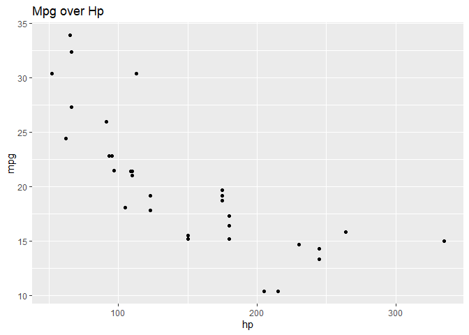
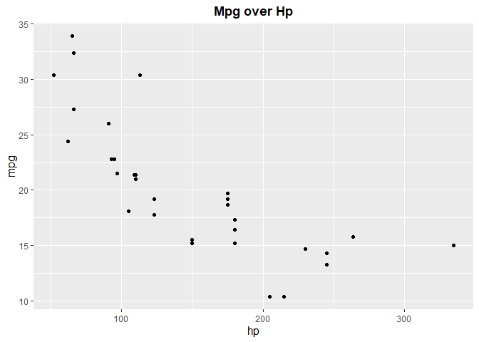

<!-- README.md is generated from README.Rmd. Please edit that file -->

# ggfixer

<!-- badges: start -->
<!-- badges: end -->

The goal of ggfixer is to modify ggplot visualizations input into it
into more appealing, outputs.

## Installation

You can install the released version of ggfixer from
[CRAN](https://CRAN.R-project.org) with:

``` r
install.packages("ggfixer")
```

## Example

This is a basic example which shows you how the ggfix command works:

``` r
library(ggfixer)
#> Loading required package: ggplot2
## basic example code
x<- ggplot(data = mtcars, aes(x = hp, y = mpg))+
geom_point()+ ggtitle("Mpg over Hp")
```

This code will result in the graph below, which is serviceable enough,
but could benefit greatly from tweaking.

``` r
x
```



## ggfix() Result

Below we put the same graph through ggfix and find it centers our text,
scales their size and generally improves the readability of the graph

``` r
ggfix(x)
```


